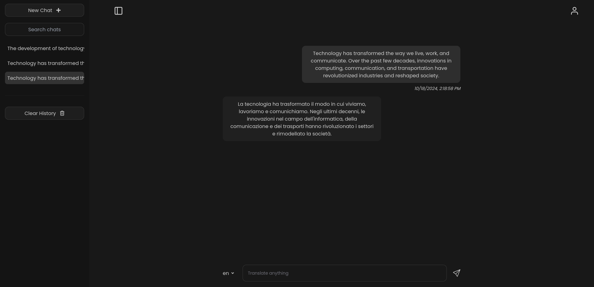

<h1 align="center">Translate</h1>
<p align="center">
A Chatbot that translates text, with a ChatGPT-like interface and support for multiple languages.
</p>



## About

Translate is a chatbot that translates text, using the Google Translate API to perform the translation. The chatbot has a ChatGPT-like interface, where the user can input text in a given language and the chatbot will respond with the translated text in the desired language.

## Features

- 🌍 Automatic language detection: Users can input text in any language and the chatbot will automatically detect the language and translate it to the desired language.
- 🌐 Support for multiple languages: You can translate to +80 different languages
- 🤖 ChatGPT-like interface:
  - The chatbot will respond with the translated text in a conversational manner.
  - You will also get the date the message was sent.
- ⚡ Real-time translation of text: The translation takes litle seconds to complete.
- 📜 Chat history:
  - The chatbot will save the chat history in a sql database.
  - You can access the chat history of any given conversation.
- 📱 Responsive design: The chatbot is responsive and works on mobile devices.

## Architecture

The app follows a client-server architecture:

- **Frontend**: Also known as the _client_, was built with TypeScript and NextJS. It is responsible for rendering the chat interface and sending the user input to the backend.
- **Backend**: Also known as the _bot_, runs on a Node.js server, created with Nest.js. The bot is responsible for handling the translation requests and responding with the translated text.
- **Database**: PostgreSQL is used to store the chat history, using TypeORM to interact with the database.
- **Google Translate API**: The app uses the Google Translate API (via [RapidAPI](https://rapidapi.com/hub)) to perform the translations. Learn more about the API [here](https://cloud.google.com/translate?hl=en).

Every time a user sends a message, the frontend sends a request to the backend with the user input. The backend then sends a request to the Google Translate API to translate the text. Once the translation is complete, we update the chat history in the database and send the translated text back to the frontend.

## How to run

All the components of the app are containerized using Docker. That makes it very easy to run the app locally. You just need to have Docker installed on your machine: [Get Docker](https://docs.docker.com/engine/install/).

### 1. Clone the repository:

```bash
git clone https://github.com/luisdanieldlcg/translate
cd translate
```

Before running the app, you need to set up the environment variables for the server. You can do that by creating a `.env` file in the `server` directory. You can use the `.env.example` file as a template.

### 2. Setting up the environment variables:

```bash
cd server
cp .env.example .env
```

This is how your `.env` file should look like:

```bash
# API server settings
API_SERVER_PORT=3000
# Database connection settings
DB_HOST=pg
DB_PORT=5432
DB_SA_PASSWORD=
DB_SA_USERNAME=postgres
DB_NAME=mydb
# Datatabase query logs
DB_LOGS=true
# Translation API keys
RAPID_API_HOST=google-api31.p.rapidapi.com
RAPID_API_KEY=your-api-key
# JWT Configuration
# Private key
JWT_PRIVATE_KEY=key
# Token lifetime
# Specify in minutes
JWT_LIFETIME=3600
```

Most of the variables should be self-explanatory.
You need to set the `RAPID_API_KEY` to your RapidAPI key. You can get a key by signing up [here](https://rapidapi.com/).

After signing up, search for the Google API and subscribe to it: [Google API](https://rapidapi.com/rphrp1985/api/google-api31).

Now search for the translate endpoint on the left panel, select NodeJS with Axios client.
Your API key will be displayed on the right side of the screen within the a header parameter: `'x-rapidapi-key': 'your-api-key'`.

Now set your `RAPID_API_KEY` to the key you just got.
